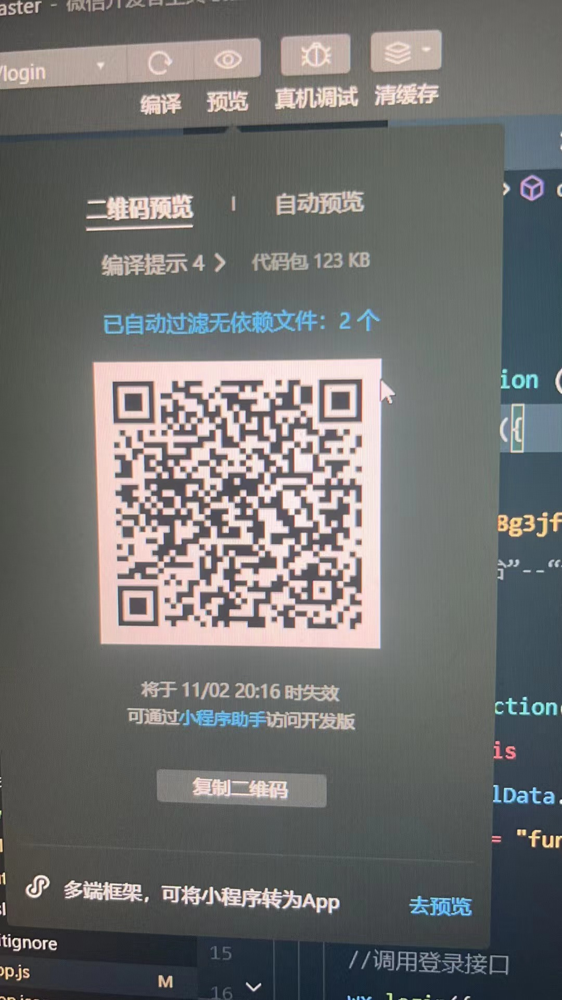

# 现场编程作业

使用微信开发者工具进行开发

## 需求

1. **基础记账：** 用户可以记录每笔支出或收入，包括：日期、金额、类别（如饮食、交通、工资等）、备注。使用本地文件保存数据：如JSON或者CSV。
2. **查看数据：** 用户可以查看最近的几笔记录。
3. **收支统计：** 用户可以根据日期，类别，金额等查看总支出和收入情况。
4. **用户友好型：** 程序应具备易于使用和操作的用户界面。
5. **附加功能（可选）：** 简单的图表展示。

## 版本

v2.0

## 使用方法

①clone本仓库，使用微信开发者工具运行

②扫描以下二维码进行使用，因二维码有时效，想用这种方法的可以联系以下该小组的组长索要新的二维码（qq：321705682）

